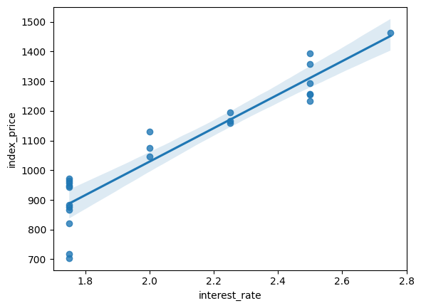
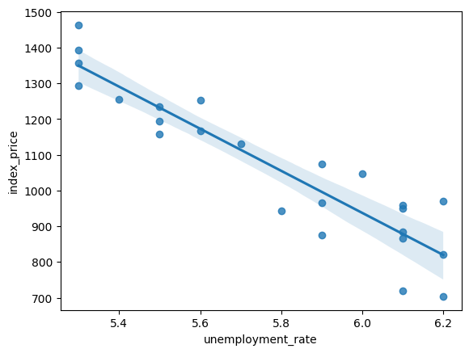
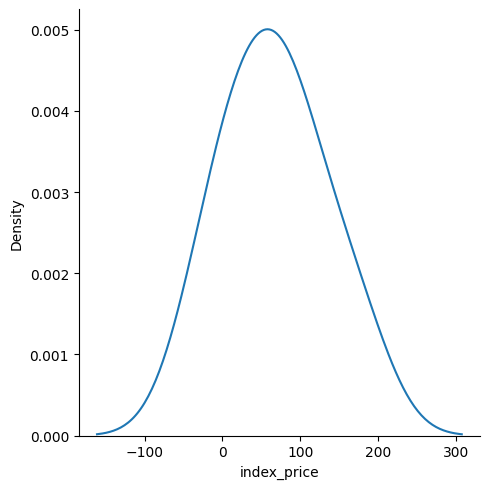

# 📊 Multiple Linear Regression - Economic Index Predictor

This project implements a **Multiple Linear Regression** model to predict the **Index Price** based on two key economic indicators: **Unemployment Rate** and **Interest Rate**. It uses Python and standard data science libraries for data analysis, model training, and evaluation.

---

## 🗂️ Dataset Information

- **Filename**: `economic_index.csv`
- **Features**:
  - `unemployment_rate` (%)
  - `interest_rate` (%)
- **Target**:
  - `index_price`

The dataset is clean and preprocessed for direct use in regression modeling.

---

## 🎯 Objective

To predict the **index price** using **multiple linear regression** based on the given unemployment and interest rates. This model can help understand how economic indicators influence the index price.

---

## ⚙️ Model Details

- **Model**: Multiple Linear Regression
- **Library Used**: `scikit-learn`
- **Evaluation Metric**: R² Score
- **Model Accuracy**: **75%**

---

## 📈 Visualizations

### 🔹 Interest Rate vs Index Price
Shows a positive correlation between interest rate and index price.

---

### 🔹 Unemployment Rate vs Index Price
Shows a negative correlation between unemployment rate and index price.

---

### 🔹 Residuals Distribution Plot
Indicates the residuals are approximately normally distributed — an assumption of linear regression.

---

## 📁 Project Structure

├── economic_index.csv # Dataset
├── Model.ipynb # Jupyter Notebook with complete analysis and code
├── README.md # Project documentation
├── RegPlot1.png # Interest Rate vs Index Price
├── RegPlot2.png # Unemployment Rate vs Index Price
└── Residuals_Distribution.png # Distribution of residuals

## ## 🚀 How to Run

1. Clone this repository or download the files.
2. Open `Model.ipynb` in Jupyter Notebook or Google Colab.
3. Run the notebook cells in order to:
   - Load and visualize data
   - Train and test the model
   - Evaluate results
